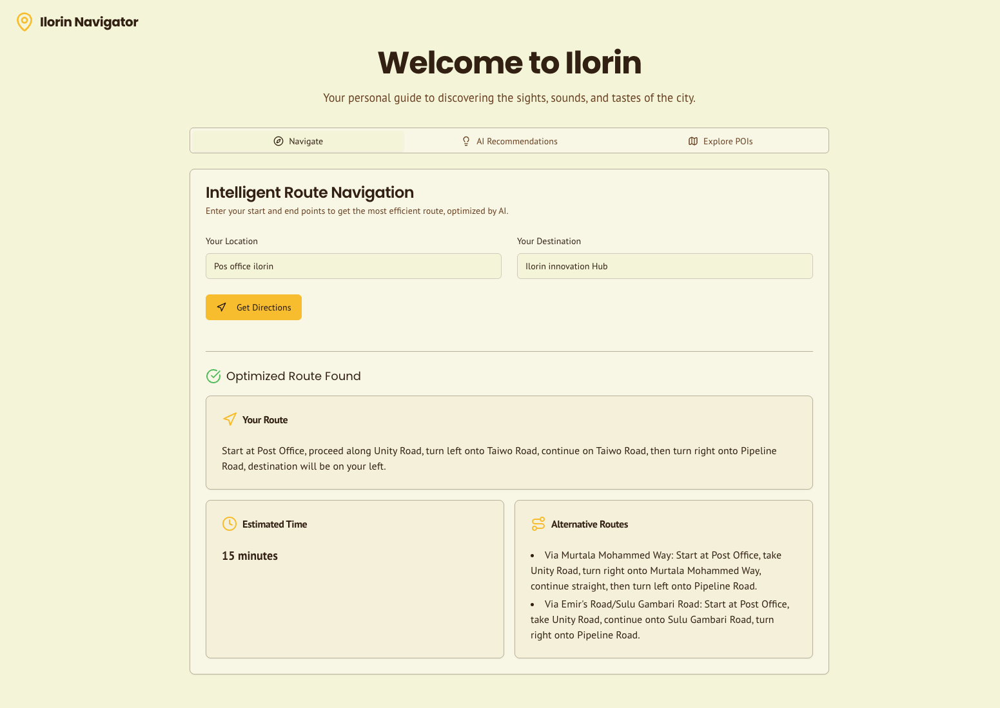
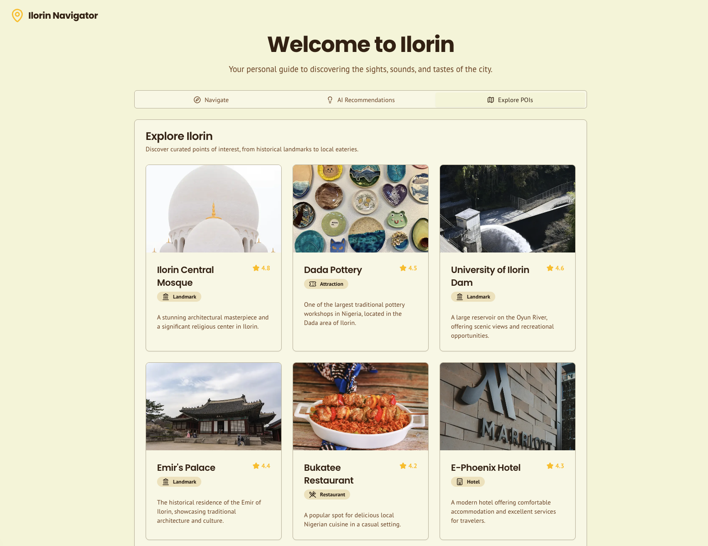

# Ilorin Navigator

Ilorin Navigator is a Next.js web application that provides intelligent, AI-assisted navigation and points-of-interest (POI) recommendations for Ilorin, Nigeria. It combines modern UI components, LLM-powered recommendation flows, and optional offline map features to deliver a helpful local navigation experience.

This repository is a starter built with Next.js, Tailwind CSS, and GenKit for AI integrations.

## Quick links

- Source: this repository
- App entry: `src/app/page.tsx`
- AI flows: `src/ai/flows`

## Features

- Location input and destination search
- Intelligent route optimization (LLM-assisted)
- Nearby points of interest with ratings and brief details
- AI-powered recommendations using GenKit flows
- Design tokens and components with Tailwind CSS and Radix UI

## Screenshots

Here are a couple of screenshots showing the app UI for the navigation and points-of-interest tabs.

### Navigation tab



The navigation tab — enter origin and destination, get intelligent route suggestions and optimization options.

### Points of Interest (POI) tab



List of nearby POIs with brief details, ratings, and quick actions.

## Tech stack

- Next.js 15
- React 18
- TypeScript
- Tailwind CSS
- GenKit (AI flows)
- Radix UI primitives
- Firebase (client SDK included)

## Getting started

Prerequisites

- Node.js (recommended 18+)
- pnpm (preferred) or npm/yarn

Install dependencies

```bash
pnpm install
```

Run in development

```bash
pnpm dev
```

Open http://localhost:9002 in your browser (the dev server uses port 9002 by default).

GenKit (AI) developer flows

The repository includes GenKit flows under `src/ai/flows`. During development you can run GenKit with the included helper scripts:

```bash
pnpm genkit:dev      # run GenKit developer server (uses src/ai/dev.ts)
pnpm genkit:watch    # run GenKit in watch mode
```

Build and production

```bash
pnpm build
pnpm start
```

Other useful scripts

- `pnpm lint` — run Next.js ESLint config
- `pnpm typecheck` — run TypeScript typecheck

## Configuration

- Environment variables: copy any `.env.example` (if present) or create a `.env` at the project root. The project uses `dotenv` for local development; GenKit and Firebase integrations may require additional keys (Google API keys, Firebase config, OpenAI/GenKit keys).

## Deployment

Below are recommended minimal settings for deploying the app. Choose one of the platforms below.

### Vercel (recommended for Next.js)

- Create a new project in Vercel and connect your Git repository.
- Set the build command to `pnpm build` and the output directory is handled by Next.js automatically.
- Set environment variables in the Vercel dashboard using the keys from `.env.example` (prefix client variables with `NEXT_PUBLIC_`).
- For server-side secrets (GenKit/OpenAI keys), mark them as Environment Variables (not exposed to the client).

### Firebase Hosting

- Build the project locally with `pnpm build` and deploy static assets to Firebase Hosting, or use a server runtime if needed.
- Ensure Firebase config variables (from `.env.example`) are set in your CI or hosting environment.

Note: If you use Vercel, the `next start` server is not required — Vercel manages the Next.js serverless/runtime. For Firebase or other hosts, ensure your host supports Next.js or use an adapter/runtime that matches your deployment choice.

## Project structure (high level)

- `src/app` — Next.js App Router pages and layout
- `src/components` — UI and app components (Radix + Tailwind primitives)
- `src/ai` — GenKit flows and AI glue code
- `src/lib` — shared utilities, types, and placeholder assets
- `docs/blueprint.md` — product/design blueprint and style guide

## Design & branding

From `docs/blueprint.md`:

- Primary color: #FFC107 (warm gold)
- Background: #F5F5DC (beige)
- Accent: #A0522D (earthy brown)
- Fonts: Poppins (headings) and PT Sans (body)

The UI is card-based with subtle transitions. Icons are used to distinguish POI categories.

## AI flows and recommended points of interest

The repository uses GenKit packages (`@genkit-ai/next` and `@genkit-ai/google-genai`) to implement LLM-powered flows. See `src/ai/flows` for examples like `recommend-points-of-interest.ts` and `optimize-navigation-route.ts` which orchestrate the recommendation and routing logic.

## Contributing

Contributions are welcome. Please open issues for features or bugs and submit pull requests for changes. Keep changes small and focused. If you add or change environment variables, update this README and `.env.example`.

See `CONTRIBUTING.md` and `CODE_OF_CONDUCT.md` for contribution guidelines and community standards.

## License

This project is released under the MIT License — see the `LICENSE` file for details.


